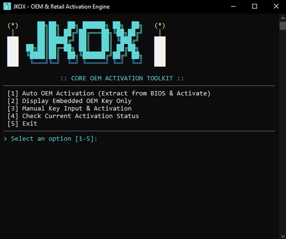

# JKOX

**JKOX** is a Windows license extraction and activation tool written in native C++. Designed specifically for technicians, system administrators, and users looking for a fast, frictionless solution, *JKOX* replaces manual console commands with a clean, aesthetic, and portable terminal experience.

Featuring a direct, guided workflow, the application inspects the motherboard for factory-embedded (OEM) product keys, applies them automatically, or activates Retail/Volume licenses step-by-step—all from a single, standalone binary.

## 📸 Screenshots

*Terminal main menu featuring themed ASCII art, pixel-art candles, and a cyan and fire-yellow color palette.*

## ✨ Key Features

* **Native Firmware Reading:** Direct access to the BIOS/UEFI ACPI `MSDM` table via low-level native API calls (`GetSystemFirmwareTable`), eliminating slow intermediaries and PowerShell dependencies.

* **Smart Key Sanitizer:** Automatic formatter for manually entered keys that removes spaces, normalizes uppercase characters, and seamlessly inserts hyphens every 5 characters.

* **Embedded UAC Elevation:** Integrated execution manifest that natively requests Administrator privileges on startup.

* **Clean & International:** Technical English standard output and silent execution via the `cscript //nologo` host to suppress intrusive Windows Script Host pop-up dialogs.

* **Retro Terminal Design & Pixel Art:** Stylized ASCII header with detailed symmetrical candles (`(*)`) and an optimized Win32 color scheme (bright cyan, pure white, technical gray, and gold accents).

* **Zero-Dependency Portability:** Statically compiled (`/MT`). A single, lightweight `.exe` file—no installers, no Visual C++ runtime requirements, ready to run directly from a USB drive on any Windows PC.

## ⚙️ What Does It Do? (Available Options)

From the console menu, *JKOX* provides the following operations:

1. **Auto OEM Activation:** Extracts the original factory-embedded product key from the motherboard's ACPI/MSDM table, installs it on the system (`slmgr /ipk`), contacts Microsoft validation servers (`slmgr /ato`), and verifies the final activation status.

2. **Display Embedded OEM Key Only:** Reads and displays the motherboard's OEM key on screen without modifying the system or altering the current license state.

3. **Manual Key Input & Activation:** Accepts manual entry of a product key (Retail, OEM, or Volume), sanitizes the input to a standard 25-character alphanumeric string, and activates it against Microsoft servers.

4. **Check Current Activation Status:** Queries the operating system's current licensing and expiration status via `slmgr /dli` and `slmgr /xpr`.

5. **Exit:** Safely closes the application.

## 🛠️ Built With

* **Language:** C++17

* **System APIs:** Windows API (`GetSystemFirmwareTable`, Win32 Console API, Desktop Shell).

* **Subsystem:** Windows Licensing Tool (`slmgr.vbs` invoked via `cscript`).

* **Binary Linking:** Static Runtime (`/MT`) x64.

* **Development Environment:** Visual Studio Enterprise 2026.

## 🚀 Installation & Usage

1. Download the executable from the [**Releases**](../../releases) section.

2. Double-click to launch it.

3. *Note:* The application will automatically prompt for **Administrator (UAC)** privileges, as the Windows Software Licensing Management Tool (`slmgr`) requires elevated rights to register keys.

4. Select your desired option (e.g., `[1]` for automatic OEM activation) and let the tool handle the process.

## 👨‍💻 Author

Created by **Yuri Alexander Pagel Krüger**
